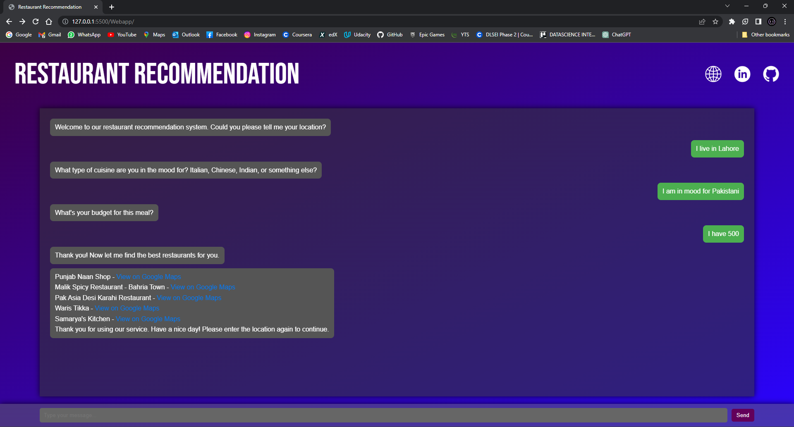

# Restaurant Recommender

The Restaurant Recommender is a chat bot that helps users discover and recommend restaurants based on their preferences. The chat bot utilizes two machine learning models - one for entity detection to understand user responses and another for restaurant recommendation.

## Features

* Entity Detection: The chat bot uses a machine learning model to detect the required entity (e.g., Location, Cuisine, Budget) from the user's response.
* Restaurant Recommendation: Based on the information provided by the user, the chat bot recommends restaurants that match their preferences, including location, cuisine, and budget.
* API Server: The chat bot is built as a FastAPI server that loads the trained machine learning models and serves as an interface to predict and provide restaurant recommendations.

## How It Works

1. User Interaction: The user interacts with the chat bot by sending messages via the API.
2. Entity Detection: The chat bot uses the first machine learning model to detect the required entity from the user's response. For example, it identifies whether the user is providing location, cuisine, or budget information.
3. Restaurant Recommendation: Once the required entity is identified, the chat bot uses the second machine learning model to recommend restaurants based on the user's preferences.
4. API Response: The chat bot responds to the user's messages via the API, providing restaurant recommendations and asking for further information if needed.

## Machine Learning Models

1. Entity Detection Model: This model is responsible for detecting the required entity (Location, Cuisine, Budget) from the user's response.

2. Restaurant Recommendation Model: This model takes the user's location, cuisine preference, and budget information to recommend restaurants that match their preferences.

The trained models are saved in the following files:

- saved_model.h5: Entity Detection Model
- restaurant_recommendation_model.h5: Restaurant Recommendation Model

## API Endpoints
The API server provides the following endpoints:

1. GET /get_entity/: This endpoint expects a POST request with the user's response and entity information (if any). It returns the next entity to ask about and any messages for the user.

2. POST /recommend/: This endpoint expects a POST request with the user's location, cuisine preference, and budget. It returns a list of recommended restaurants based on the provided information.

## How to Run the Project
1. Clone the repository.

2. Install the required dependencies using pip install -r requirements.txt.

3. Place the trained models (saved_model.h5 and restaurant_recommendation_model.h5) in the project directory.

4. Run the API server using uvicorn main:app --reload.

5. Run another local server and open index.html in your browser.

6. Interact with the chat bot by sending API requests and receiving restaurant recommendations.

## Conclusion

The Restaurant Recommender chat bot is a powerful tool to help users find the perfect restaurant based on their preferences. It efficiently uses machine learning models for entity detection and restaurant recommendation, providing an intuitive and user-friendly experience for discovering new dining options. Enjoy exploring new restaurants with the help of the Restaurant Recommender!

